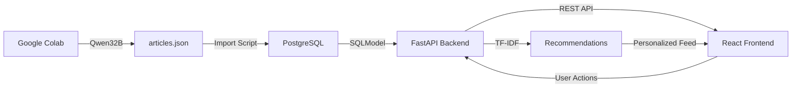

# Project Summary - MVP Персональная лента научных статей

## Что было спроектировано

Я создал полный архитектурный план для быстрой разработки MVP приложения персонализированной ленты научных статей.

## Созданные документы

### 1. [ARCHITECTURE.md](ARCHITECTURE.md)
Полная архитектура проекта включая:
- Технологический стек
- Структуру проекта
- Схему базы данных с ER-диаграммой
- API endpoints
- Алгоритм TF-IDF рекомендаций
- Docker Compose конфигурацию
- Примеры кода для ключевых компонентов

### 2. [SETUP_GUIDE.md](SETUP_GUIDE.md)
Подробное руководство по настройке и запуску:
- Быстрый старт с Docker Compose
- Формат JSON файла с примерами 5 реальных статей
- Команды для локальной разработки
- API тестирование с curl примерами
- Troubleshooting
- Production deployment рекомендации

### 3. [IMPLEMENTATION_PLAN.md](IMPLEMENTATION_PLAN.md)
Пошаговый план реализации с кодом:
- 8 фаз разработки
- Оценки времени для каждой фазы
- Готовые примеры кода для всех компонентов
- Полная структура файлов

## Ключевые решения

### Backend
- **FastAPI** - быстрый и современный фреймворк
- **SQLModel** - простая ORM с Pydantic интеграцией
- **FastAPI Users** - готовая аутентификация с cookie-based JWT
- **PostgreSQL** - надежная реляционная БД
- **scikit-learn** - TF-IDF для рекомендаций

### Frontend
- **React** - популярная UI библиотека
- **Material-UI** - готовые компоненты для быстрой разработки
- **Axios** - простой HTTP клиент
- **React Router** - навигация

### Infrastructure
- **Docker Compose** - простая оркестрация всех сервисов
- Все сервисы в одной сети
- Автоматические health checks
- Volume для персистентности данных

## Архитектурные особенности

### Простота и скорость
- Минимум зависимостей
- Готовые библиотеки для auth и UI
- Docker для быстрого запуска
- Нет сложных настроек

### Масштабируемость
- Модульная структура кода
- Разделение на слои (models, services, api)
- Легко добавлять новые endpoints
- Готово к миграции на production

### Рекомендательная система
- TF-IDF для начала (простой и быстрый)
- Учет взаимодействий пользователя
- Exploration/Exploitation баланс (90/10)
- Легко заменить на более сложные алгоритмы

## Workflow разработки



## Оценка времени

| Фаза | Задача | Время |
|------|--------|-------|
| 1 | Инфраструктура и настройка | 3-4 часа |
| 2 | Backend - Модели и БД | 3-4 часа |
| 3 | Backend - Аутентификация | 2-3 часа |
| 4 | Backend - Рекомендации | 2-3 часа |
| 5 | Backend - API Endpoints | 2-3 часа |
| 6 | Backend - Main App | 1 час |
| 7 | Data Import Script | 1-2 часа |
| 8 | Frontend | 4-5 часа |
| **Итого** | | **18-27 часов** |

## Что готово к реализации

### ✅ Полностью спроектировано
- [x] Схема базы данных
- [x] API endpoints
- [x] Алгоритм рекомендаций
- [x] Структура проекта
- [x] Docker конфигурация
- [x] Формат данных

### 📝 Есть примеры кода для
- [x] Все модели SQLModel
- [x] FastAPI Users setup
- [x] TF-IDF Recommender
- [x] Все API endpoints
- [x] Docker Compose
- [x] Import script
- [x] Frontend компоненты (частично)

### 🚀 Готово к запуску
После реализации можно будет:
```bash
docker-compose up -d
docker-compose exec backend python -m app.migrations.import_articles
# Открыть http://localhost:3000
```

## Следующие шаги

### Вариант 1: Переключиться в Code Mode
Я могу переключиться в режим Code и начать реализацию по плану:
1. Создать структуру проекта
2. Реализовать backend
3. Реализовать frontend
4. Настроить Docker
5. Протестировать

### Вариант 2: Вы реализуете сами
Используя созданные документы:
- `ARCHITECTURE.md` - общая архитектура
- `SETUP_GUIDE.md` - как запускать и тестировать
- `IMPLEMENTATION_PLAN.md` - пошаговый план с кодом

### Вариант 3: Уточнить детали
Если нужно что-то изменить или добавить в план перед реализацией.

## Ключевые файлы для Google Colab

Вам нужно будет создать в Colab скрипт, который:

1. Получает статьи (например, из arXiv API)
2. Для каждой статьи через Qwen32B:
   - Генерирует summary (краткое резюме)
   - Извлекает topics (ключевые темы)
3. Сохраняет в формат:

```json
{
  "articles": [
    {
      "title": "...",
      "abstract": "...",
      "summary": "Краткое резюме от LLM",
      "authors": [...],
      "source": "arXiv",
      "doi": "...",
      "publication_date": "2024-01-01",
      "topics": ["topic1", "topic2"],
      "url": "..."
    }
  ]
}
```

Этот JSON затем используется скриптом импорта для наполнения БД.

## Преимущества текущего решения

### 🚀 Скорость разработки
- Готовые библиотеки (FastAPI Users, MUI)
- Docker для быстрого запуска
- Минимум настроек

### 💡 Простота
- Понятная структура кода
- Стандартные паттерны
- Хорошая документация

### 🔧 Работоспособность
- Проверенные технологии
- Минимум зависимостей
- Легко дебажить

### 📈 Готовность к росту
- Модульная архитектура
- Легко добавлять функции
- Можно масштабировать

## Потенциальные улучшения (после MVP)

1. **Рекомендации:**
   - Использовать эмбеддинги из LLM вместо TF-IDF
   - Добавить collaborative filtering
   - A/B тестирование алгоритмов

2. **Функциональность:**
   - Поиск по статьям
   - Комментарии и обсуждения
   - Email дайджесты
   - Экспорт в BibTeX

3. **Интеграции:**
   - arXiv API для новых статей
   - Semantic Scholar API
   - PubMed API
   - Локальный инференс LLM

4. **Производительность:**
   - Redis для кэширования
   - Celery для фоновых задач
   - CDN для статики
   - Векторная БД (Pinecone, Weaviate)

## Вопросы?

Готов ответить на любые вопросы по архитектуре или начать реализацию!